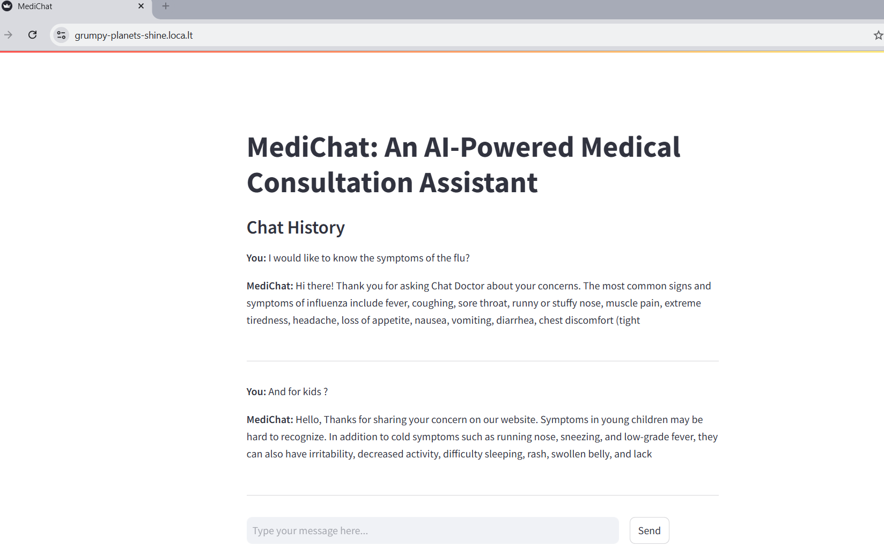

# MediChat: AI-Powered Medical Consultation Assistant

MediChat is an intelligent assistant designed to provide medical consultations using advanced natural language processing models. This project leverages a fine-tuned version of the original LLaMA-3.1-8B model, trained on medical conversation datasets. Specifically, the model benefits from training data sourced from [ChatDoctor-HealthCareMagic-100k](https://huggingface.co/datasets/lavita/ChatDoctor-HealthCareMagic-100k), enabling it to deliver accurate and context-aware responses in a conversational format.

---

## Table of Contents

- [Features](#features)
- [Setup](#setup)
  - [Dependencies](#dependencies)
  - [Docker Support](#docker-support)
- [Usage](#usage)
- [Project Structure](#project-structure)
- [Example Interaction](#example-interaction)
---

## Features

- **Multilingual Support**: Understands French input and responds contextually (responses default to English).
- **Medical Context**: Fine-tuned on medical data for specialized knowledge.
- **Contextual Memory**: Tracks conversation history for meaningful interactions.
- **Customizable Prompts**: Easily adaptable for other domains.

---

## Setup

### Dependencies

1. Install Python 3.8+.
2. Install required Python packages:
   ```bash
   pip install -r requirements.txt
   ```
3. Authenticate with Hugging Face Hub:
   ```bash
   huggingface-cli login
   ```
   Replace the token in `model.py` with your Hugging Face token.

---

### Docker Support

This project includes a `Dockerfile` to containerize the application for easy deployment.

1. Build the Docker image:
   ```bash
   docker build -t medichat-app .
   ```
2. Run the container:
   ```bash
   docker run -p 8501:8501 medichat-app
   ```
3. Access the application at `http://localhost:8501`.

---

## Usage

1. Clone the repository:
   ```bash
   git clone https://github.com/username/medichat.git
   cd medichat
   ```
2. Start the application:
   ```bash
   streamlit run app.py
   ```
3. Open your browser at `http://localhost:8501` to interact with MediChat.

---

## Project Structure

```plaintext
├── app.py                   # Entry point for the Streamlit app
├── model.py                 # Loads the LLaMA-based medical model
├── conversation_chain.py    # Custom conversation handler with memory
├── utils.py                 # Utilities for generating and formatting responses
├── requirements.txt         # Python dependencies
├── Dockerfile               # Docker configuration for containerizing the app
└── README.md                # Project documentation
```

---

## Example Interaction




### Note on Greetings

The model always begins responses with a greeting such as "hi, ..." due to the training data sourced from [ChatDoctor-HealthCareMagic-100k](https://huggingface.co/datasets/lavita/ChatDoctor-HealthCareMagic-100k), which often included greetings in conversational examples. 

#### Proposed Solution

To address this, we recommend the following approach:
1. **Explicitly Handle Greetings**: Modify the application to provide an initial greeting at the start of the session rather than relying on the model.
2. **Retraining the Model**: Redo the fine-tuning process by explicitly removing greetings from the training dataset. This ensures that the model generates responses focused solely on the medical context without starting with greetings.

---

